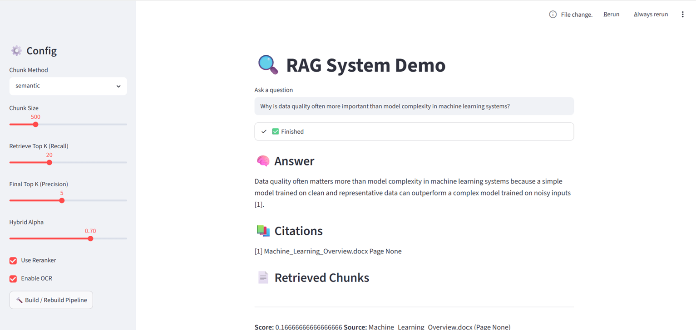

# ModularRAG

A modular Retrieval-Augmented Generation (RAG) framework for document question answering.

## Features

Hybrid Retrieval (Dense + BM25)

Multiple Chunking Strategies

CrossEncoder Reranker

OCR-enhanced PDF & DOCX Parsing

Configurable Retrieval Pipeline

Evaluation Pipeline

Streamlit Demo

Citation-aware Answer Generation

## Project Structure

```text
ModularRAG
├── data/
├── notebooks/
├── src/
│   ├── chunking/
│   ├── evaluation/
│   ├── experiment/
│   ├── loaders/
│   ├── models/
│   ├── output/
│   ├── rag/
│   ├── retrieval/
│   ├── vector_store/
│   ├── config.py
│   └── env.py
├── app.py
├── run.py
├── requirements.txt
└── README.md

## Demo

